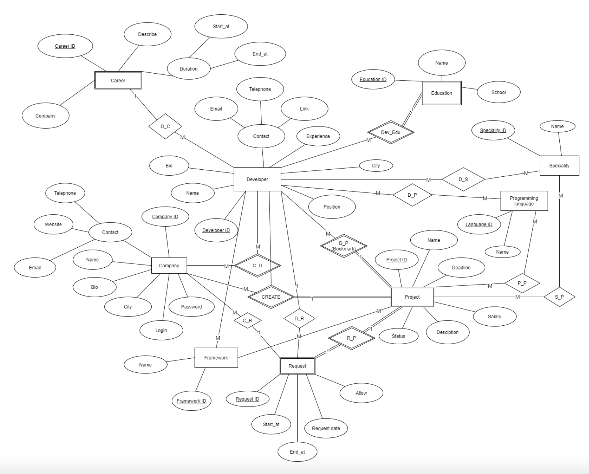
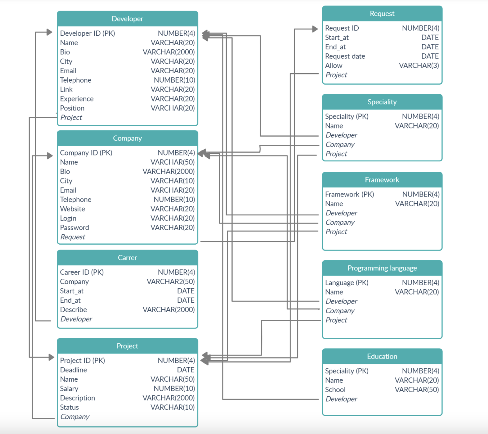

# Searching website

## Проектирование сущностей и связей, схемы персистентности

* # 1. Список сущностей и связей:

## Таблица 1: Список сущностей и связей

|Сущность|Свойство||Комментарии|
|---|---|---|---|
|Company(Компания)|Company ID (Номер)||Идентификационный номер компании. Ключевое свойство типа сущности.|
||Name(Имя)||Имя компании. Свойством обладают всеэкземпляры типа сущности|
||Bio||Описание о компании. Свойством обладают все экземпляры типа сущности.|
||Contact|City|Рабочее место компании. Свойством обладаютвсе экземпляры типа сущности.|
|||Email|Электронная почта компании. Свойством обладают все экземпляры типа сущности.|
|||Telephone | Номер телефона компании. Свойством обладают все экземпляры типа сущности.|
|||GitHub |GitHub аккаунт. Свойством обладают все экземпляры типа сущности.|
|||GitLab| GitLab аккаунт. Свойством обладают все экземпляры типа сущности.|
|||Facebook| Facebook аккаунт. Свойством обладают все экземпляры типа сущности.|
|||Instagram| Instagram аккаунт. Свойством обладают все экземпляры типа сущности.|
||Login (Логин)||Имя учетной записи пользователя. Ключевое свойство типа сущности.|
||Password (Пароль)||Пароль пользователя. Свойством обладают все экземпляры типа сущности.|
|Developer (Программист)|Developer ID||Идентификационный номер программиста. Ключевое свойство типа сущности.|
||Name||Имя программиста. Свойством обладают все экземпляры типа сущности|
||Bio| |Описание программиста. Свойством обладают все экземпляры типа сущности.|
||Contact|City|Рабочее место программиста. Свойством обладают все экземпляры типа сущности.|
|||Email |Электронная почта компании. Свойством обладают все экземпляры типа сущности.|
|||Telephone| Номер телефона компании. Свойством обладают все экземпляры типа сущности.|
|||GitHub |GitHub аккаунт. Свойством обладают все экземпляры типа сущности.|
|||GitLab|GitLab аккаунт. Свойством обладают все экземпляры типа сущности.|
|||Facebook|Facebook аккаунт. Свойством обладают все экземпляры типа сущности.|
|||Instagram| Instagram аккаунт. Свойством обладают все экземпляры типа сущности.|
||Experience|| Опыт работы программиста. Свойством обладают все экземпляры типа сущности|
||Position|| Должность в работе программиста. Свойством обладают все экземпляры типа сущности.|
||Login|| (Логин) Имя учетной записи пользователя. Ключевое свойство типа сущности.|
||Password (Пароль)|| Пароль пользователя. Свойством обладают все экземпляры типа сущности.|
|Education|Name||Имя образования. Свойством обладают все экземпляры типа сущности.|
||School||ВУЗ программиста. Свойством обладают все экземпляры типа сущности|
||Duration|Start_at|Время начала образования|
|||End_at|Время окончания образования|
|Emplpyment|Employment ID||Идентификационный номер карьеры. Ключевое свойство типа сущности.|
||Company||Название компании, в которой работает программист|
||Duration|Start_at|Время начала работы программиста|
|||End_at|Время окончания работы программиста|
||Describe||Описание работы программиста. Свойством обладают все экземпляры типа сущности.|
|Specialities|Specialities ID||Идентификационный номер специальности. Ключевое свойство типа сущности|
||Name||Имя специальности. Свойством обладают все экземпляры типа сущности|
|Frameworks|Framework ID ||Идентификационный номер фреймворка. Ключевое свойство типа сущности.|
||Name||Имя фреймворка. Свойством обладают все экземпляры типа сущности|
|Programming languages|Language ID||Идентификационный номер языка. Ключевое свойство типа сущности.|
||Name||Имя языка программирования. Свойством обладают все экземпляры типа сущности|
|Projects|Project ID||Идентификационный номер проекта. Ключевое свойство типа сущности.|
||Deadline||Срок сдачи проекта. Свойством обладают все экземпляры типа сущности|
|| Project Name||Имя проекта. Свойством обладают все экземпляры типа сущности|
||Salary||Зарплата. Свойством обладают все экземпляры типа сущности|
||Short description ||Описание проекта. Свойством обладают все экземпляры типа сущности|
||Status||Стаус проекта. Свойством обладают все экземпляры типа сущности|
|Request|Request ID||Идентификационный номер запроса. Ключевое свойство типа сущности.|
||Create_at||Дата подачи запроса. Свойством обладают все экземпляры типа сущности|
||Update_at||Дата обновления запроса. Свойством обладают все экземпляры типа сущности|
||Project_id||Идентификационный номер проекта, пользователь хочет присоединиться|
||User_id||Идентификационный номер пользователя, который сделал запрос|

* # 2. ER-диаграмма

* # 3. Модель базы данных

