# Searching website

## Проектирование интерфейса пользователя

* # 1.Списки веб-страниц

В системе ProSea для незарегистрированных пользователей будут доступны следующие страницы

    * Главная страница системы;
    * Авторизация;
    * Регистрация.
    * Информация о проекте.

Действующее лицо developer будут доступны следующие страницы

    * Информация программиста Profile
    * Опыт программиста Experiment
    * Отзыв программиста Review
    * Создавание проектов Create project
    * Запрос на присоединение к проекту Request
    * Информация проектов Project
    * Bookmarks

Действующее лицо company будут доступны следующие страницы

    * Profile
    * История проектов
    * Создавание проектов Create project
    * Запрос на присоединение проектов Request
    * Recruitment

* # 2.Эскизы веб-страниц
|||
|-|-|
|Эскиз страницы Главной станицы системы Home Page|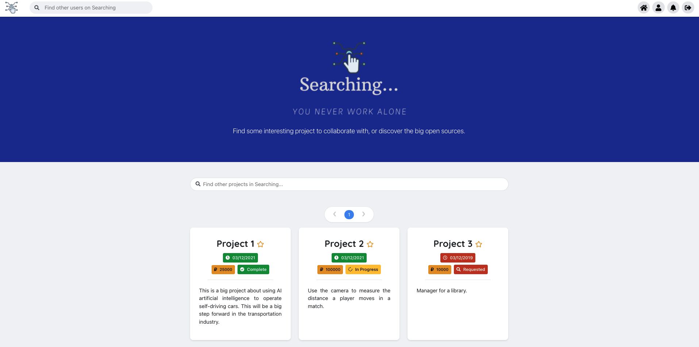|
|Эскиз страницы Project Modal Page|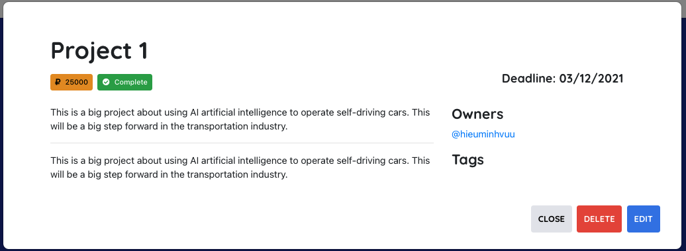|
|Эскиз страницы Registration|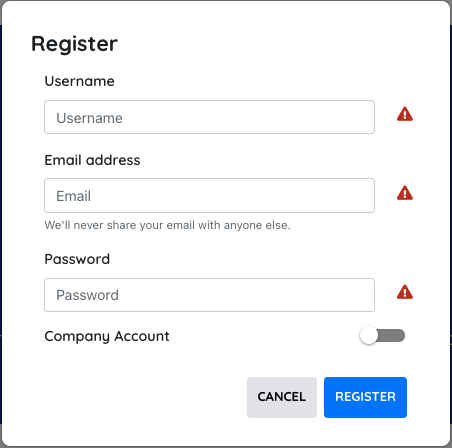|
|Эскиз страницы Login|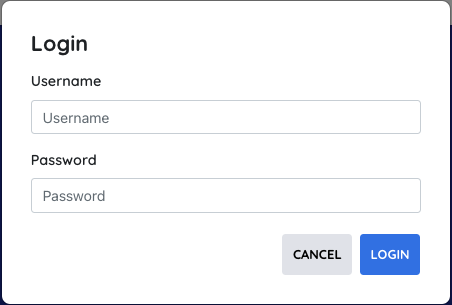|
|Эскиз страницы Profile of Developer|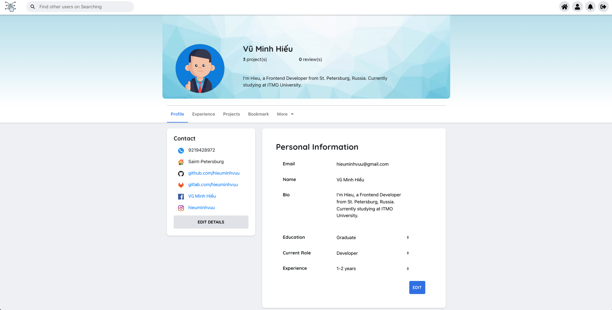|
|Эскиз страницы Edit Contact|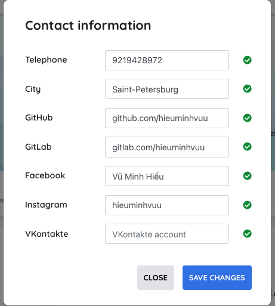|
|Эскиз страницы Experiment of Developer|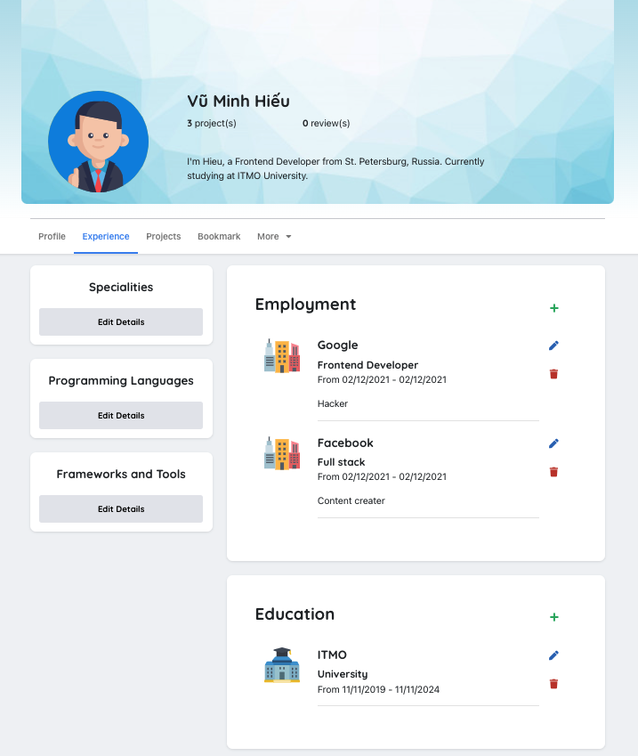|
|Эскиз страницы Specialities of Developer|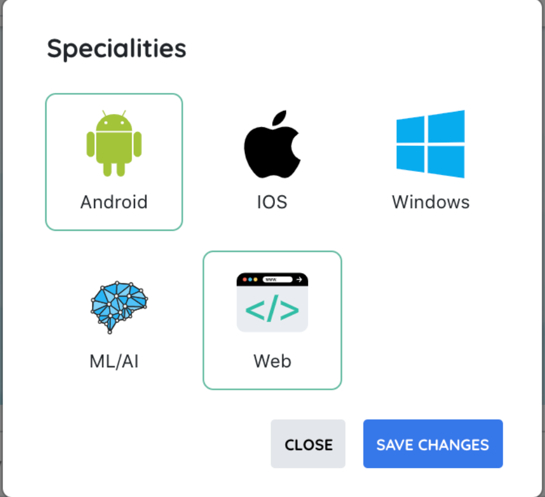|
|Эскиз страницы Programming Languages|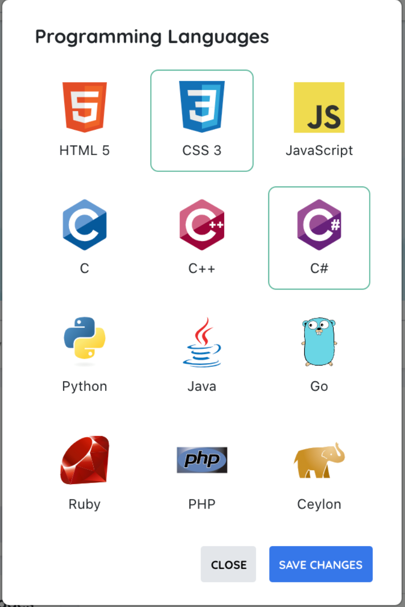|
|Эскиз страницы Frameworks and Tools of Developer|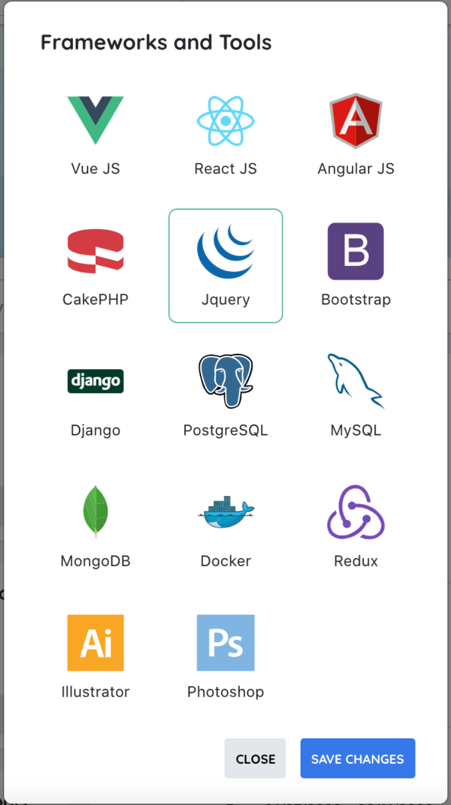|
|Эскиз страницы Review of Developer|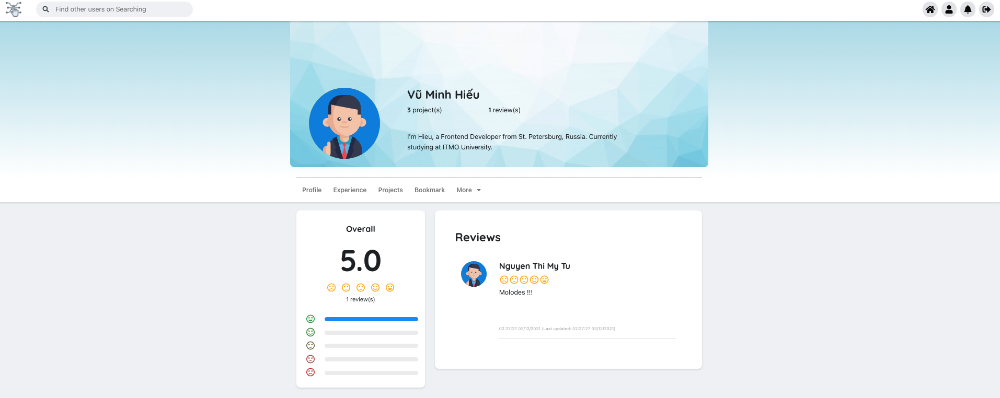|
|Эскиз страницы Projects of Developer|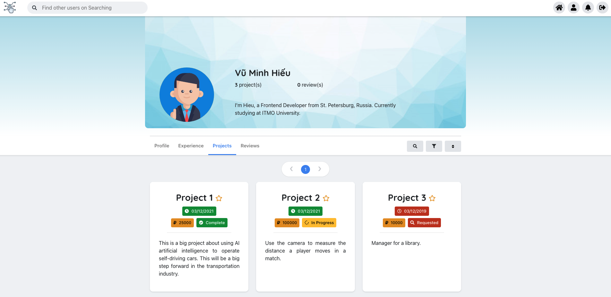|
|Эскиз страницы Bookmark of Developer|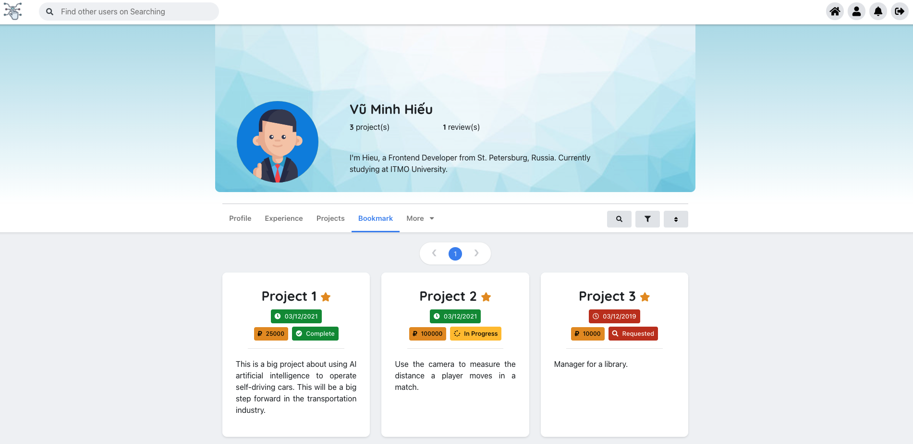|
|Эскиз страницы Add Project of Developer|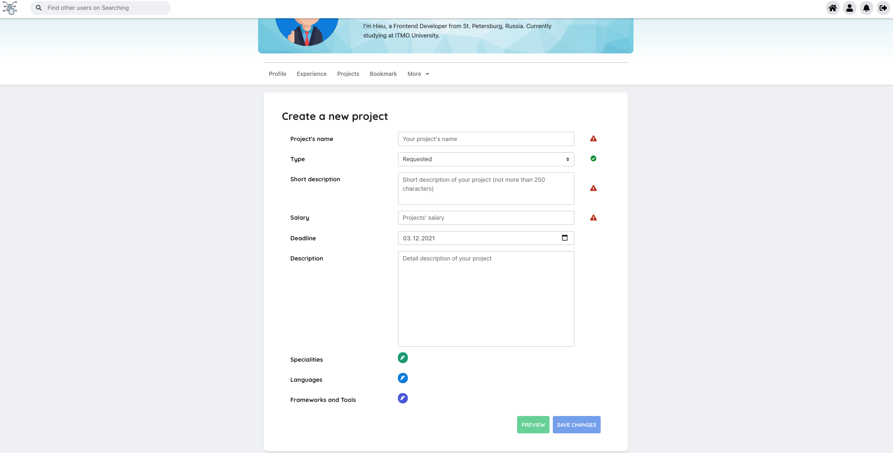|
|Эскиз страницы Join request of Developer|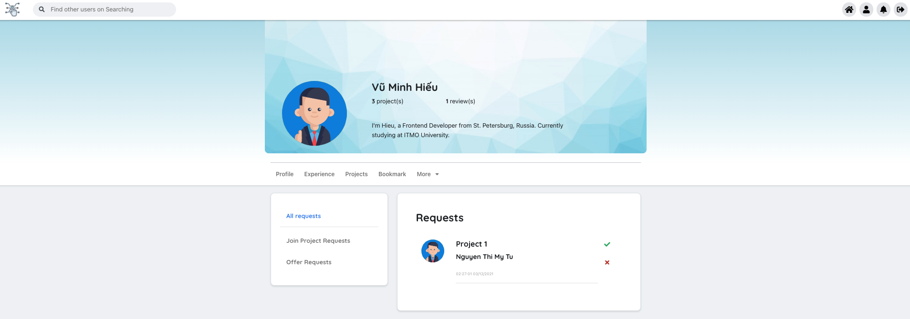|
|Эскиз страницы Profile of Company|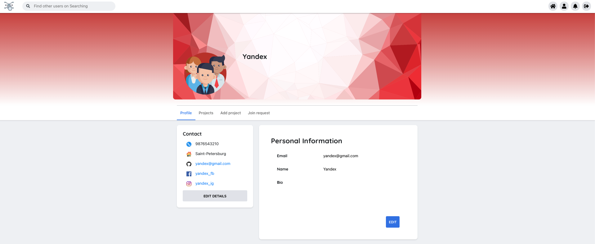|
|Эскиз страницы Add Project of Company|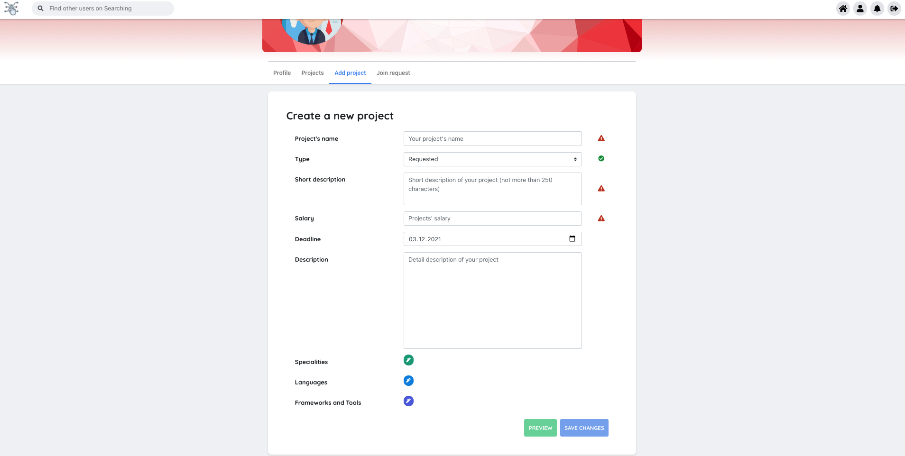|

* # 3.Сценарии работы пользователя

    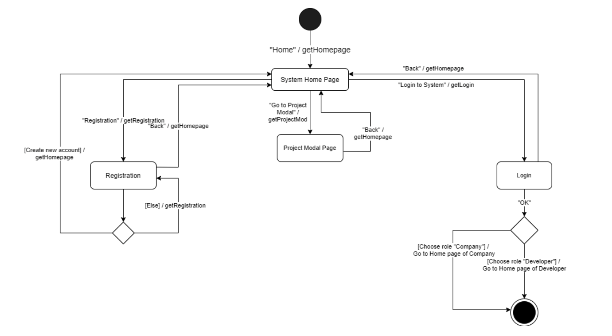
    # Сценарий работы действующего лица Гость

    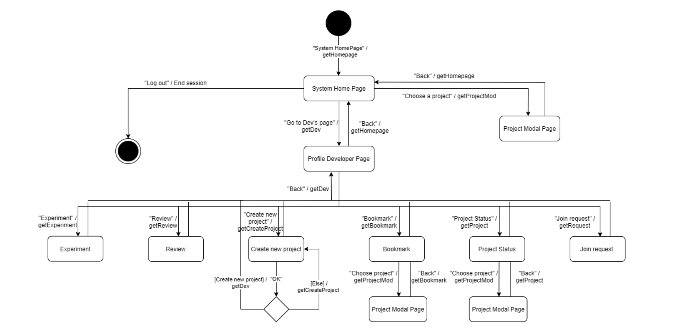
    # Сценарий работы действующего лица Developer

    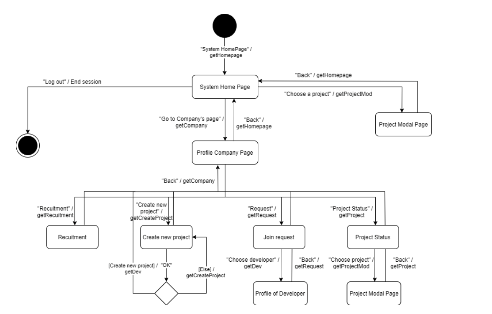
    # Сценарий работы действующего лица Company

|Название|Описание|
|-|-|
|Действующее лицо Гость|
|getHomepage|Выводит на экран главную страницу системы.|
|getRegistration|Выводит на экран страницу регистрации.|
|getProjectMod|Выводит на экран pop-up проекта.|
|getLogin|Выводит на экран страницу авторизации.|
|Действующее лицо Developer|
|getHomepage|Выводит на экран главную страницу системы.|
|getProjectMod|Выводит на экран pop-up проекта.|
|getDev|Выводит на экран станицу профиля программиста .|
|getExperiment|Выводит на экран станицу опыта программиста .|
|getReview|Выводит на экран станицу отзыва программиста .|
|getCreateProject|Выводит на экран станицу, где создать новый проект.|
|getBookmark|Выводит на экран станицу закладки проектов.|
|getProject|Выводит на экран станицу, в котором показать статус проектов.|
|getRequest|Выводит на экран станицу запросы программиста .|
|Действующее лицо Company|
|getHomepage|Выводит на экран главную страницу системы.|
|getProjectMod|Выводит на экран pop-up проекта.|
|getDev|Выводит на экран станицу профиля программиста .|
|getCreateProject|Выводит на экран станицу, где создать новый проект.|
|getRecuitment|Выводит на экран станицу информации о наборе персонала|
|getProject|Выводит на экран станицу, в котором показать статус проектов.|
|getRequest|Выводит на экран станицу запросы компании .|