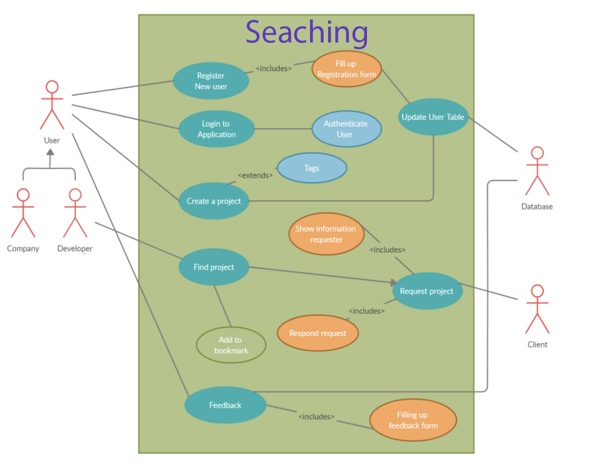

# Searching website

## Описание прецедентов использования

* # Список акторов

    * User (включается company и developer): После регистрация в систему, он станёт авторизированным пользователем, имеет право на создание проекта, поиск проектов и написание отзыва.
    * Database: База данных, где можно хранить, изменять и обновлять данные
    * Client: авторизированный пользователь, имеет права на создание и редактирование учетных записей пользователей, принятие или отклонение запроса

* # Схема

    

* # Спецификации прецедентов использования

## Таблица 1: Регистрация и авторизования пользователя
|Прецедент использования|Регистрация пользователя|
|---|---|
|Краткое описание|Этот прецедент использования позволяет действующему лицу User зарегистрировать в системе новую учетную запись.|
|Действующие лица|User|
|Предусловия|Действующее лицо User желает зарегистрировать новую учетную запись|
|Основной поток|Прецедент использования начинается с того, что Гость решает зарегистрировать новую учетную запись и заполняет соответствующую регистрационную форму, обязательно указав вид аккаунта (developer или company), свою электронной почту, имя учетной записи и пароль, после чего отправляет заявку на регистрацию. Данные передаются в таблицу в базе данных. Прецедент использования завершается.|
|Альтернативные потоки|Действующее лицо User неверно заполнило регистрационную форму или учетная запись с указанным именем уже существует. Заявка на регистрацию не создается, действующее лицо User получает сообщение об ошибке и должно либо повторно заполнить форму, продолжая прецедент использования, либо отменить регистрацию, завершая прецедент использования.|
|Постусловия|Если прецедент использования завершился успешно, в системе регистрируется новая учетная запись, в противном случае перенаправить на страницу профиля.|

## Таблица 2: Создание проекта
|Прецедент использования|Создание проекта|
|---|---|
|Краткое описание|Этот прецедент использования позволяет действующему лицу User создат новый проект в системе.|
|Действующие лица|User|
|Предусловия |Действующее лицо User желает создат новый проект в системе.|
|Основной поток|Прецедент использования начинается с того, что User решает создат новый проект в системе и заполняет соответствующую информацию проекта, обязательно указав своё называние проекта, зарплату, тег, закладку, краткое описание, описание и тип (запрошено, в процессе или завешено). Данные передаются в таблицу в базе данных. Прецедент использования завершается.|
|Альтернативные потоки| Действующее лицо User не заполнил необходимую информацию. Заявка на проект не создается, действующее лицо User получает сообщение об ошибке и должно либо повторно заполнить форму, продолжая прецедент использования, либо отменить создавать проект, завершая прецедент использования. Поощряем пользователей добавлять теги|
|Постусловия|Если прецедент использования завершился успешно, в системе создается новый проект, в противном случае состояние системы остается неизменным|

## Таблица 3: Поиск проекта
|Прецедент использования|Поиск проекта|
|---|---|
|Действующие лица|User|
|Предусловия |Действующее лицо User желает искать проект в системе.|
|Основной поток| Прецедент использования начинается с того, что User ищет проект в системе. Данные передаются в таблицу в базе данных. Полученные результаты являются подходящими проектами. Прецедент использования завершается. Если ему интересно, он может положить его в закладки, в противном случае, если проект уже в закладки, он может удалить его в закладки.|
|Альтернативные потоки|Действующее лицо User не хватает заполнить необходимую информацию. Заявка на результат проекта не создается, действующее лицо User получает сообщение об ошибке и должно либо повторно искать проект, продолжая прецедент использования, либо отменить искать проект, завершая прецедент использования.|
|Постусловия| Если прецедент использования завершился успешно, приведены результаты поиска, в противном случае, система не дает результата|

## Таблица 4: Отзыв
|Прецедент использования|Отзыв действующего лица|
|---|---|
|Краткое описание| Этот прецедент использования позволяет действующему лицу User оценить проект или позователь.|
|Действующие лица|User|
|Предусловия| Действующее лицо User желает оценить проект или позователь|
|Основной поток| Прецедент использования начинается с того, что User завершил работу. Они могут оценивать друг друга и проект. Данные передаются в таблицу в базе данных. Прецедент использования завершается.|
|Альтернативные потоки| Действующее лицо User не писать отзыв. Никакая информация не передается в базу данных. Завершает прецедент использования.|
|Постусловия| Если прецедент использования завершился успешно, информация добавляется в базу данных, в противном случае, состояние базы данных остается неизменным.|

## Таблица 5: Ответ на запрос
|Прецедент использования|Ответ на запрос|
|---|---|
|Краткое описание| Этот прецедент использования позволяет действующему лицу User отвечать на запрос проекта.|
|Действующие лица|Client|
|Предусловия| Действующее лицо Client рассматривает, оценивает и отвечает на этот запрос.|
|Основной поток| Прецедент использования начинается с того, что User выберал проект. Запрос этого проекта создан и отправлен к Client. В то же время, Client может смотреть информацию у Developer, решая принять или отклонить запрос. Данные передаются в таблицу в базе данных. Прецедент использования завершается.|
|Альтернативные потоки|Действующее лицо Client не отвечал запрос. Никакая информация не передается в базу данных. Завершает прецедент использования.|
|Постусловия |Если прецедент использования завершился успешно, информация добавляется в базу данных, User получит ответ запроса, в противном случае, состояние базы данных остается неизменным.|